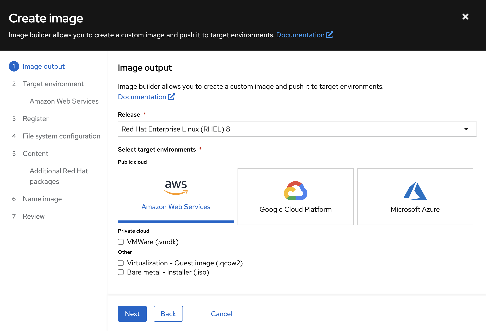

In this lab, we'll prepare the High Side. Recall from our architecture diagram that our bastion server on the high side will host our mirror registry. To do this we're interested in using `podman`, since it simplifies operation of the registry to run it within a container. 

However, we have a dilemma: the AMI we used for the prep system does not have `podman` installed! We could rectify this by running `sudo dnf install -y podman` on the prep system, but the bastion server won't have Internet access, so we need another option. Unfortunately, `podman` cannot be sneakernetted into the bastion server as we're doing with other tools, because the installation requires a number of dependencies.

To solve this problem, we need to *build our own RHEL image* with `podman` pre-installed. Real customer environments will likely already have a solution for this, but one approach is to use the **Image Builder** in the Hybrid Cloud Console, and that's exactly what we'll do.

## Using Image Builder
Image Builder, bundled with Red Hat Insights, enables you to create customized images and upload them to a variety of cloud environments, such as Amazon Web Services, Microsoft Azure and Google Cloud Platform. You also have the option to download the images you create for on-prem infrastructure environments. Let's get started:

1. Visit the Image Builder service in the [Hybrid Cloud Console](https://console.redhat.com/insights/image-builder) and click **Create Image**.
2. Let's use the Red Hat Enterprise Linux (RHEL) 8 Release, and AWS for the target environment. Then click **Next**. 
   
3. Grab your AWS account ID from your workstation by running:
   ```execute-2
   aws sts get-caller-identity --query "Account" --output text
   ```
   > You can also get this from the web console using the URL provided in your email from RHDP.

   Specify this in the **AWS account ID** and click **Next**. Image Builder will push the image to a Red Hat-owned AWS account and share it with the account ID you specify.
   
4. Leave the default Registration method selected. If you already have an Activation Key available to use, select it, click **Next**, and skip to Step 5. Otherwise, let's go create one in [Remote Host Configuration](https://console.redhat.com/settings/connector/activation-keys)
   * Click **Create activation key**, make the following selections and click **Create**:
      
5. Leave the default File system configuration and click **Next**
6. Here's our opportunity to add some packages to the VM: let's search for `podman`, and `git` in case we need it later. Then click **Next**.
   
   > Use the right arrow in the middle of the pane to populate the Chosen packages section.
7. Give your image a sweet name, like **aws-disco-bastion-image** and click **Next**
8. Click **Create Image** on the next screen, and wait a few minutes for your image build to complete. Time for more coffee!

## Creating a Bastion Server
Once the image build is complete, we can create the bastion server. Your mirror may still be running from lab 4, so run these commands in a new terminal.

1. Grab the ID of a private subnet from the high side of our VPC:
   ```execute-2
   PRIVATE_SUBNET=$(aws ec2 describe-subnets | jq '.Subnets[] | select(.Tags[].Value=="Private Subnet - disco").SubnetId' -r)
   echo $PRIVATE_SUBNET
   ```
2. Obtain the AMI ID from the Cloud Provider Identifiers in Image Builder, and set it as an environment variable:
   
   ```copy
   BASTION_AMI_ID=<your ami id>
   ```
3. Then spin up your EC2 instance. We're going to use a `t3.large` instance type which provides 2vCPU and 8GiB of RAM, along with a 50GiB volume to meet our storage requirements:
   ```execute-2
   BASTION_NAME="disco-bastion-server"
   
   aws ec2 run-instances --image-id $BASTION_AMI_ID --count 1 --instance-type t3.large --key-name disco-key --security-group-ids $SG_ID --subnet-id $PRIVATE_SUBNET --tag-specifications "ResourceType=instance,Tags=[{Key=Name,Value=$BASTION_NAME}]" --block-device-mappings "DeviceName=/dev/sdh,Ebs={VolumeSize=50}"
   ```

## Accessing the High Side
Now we need to access our bastion server on the high side. In real customer environments, this might entail use of a VPN, or physical access to a workstation in a secure facility such as a SCIF. To make things a bit simpler for our lab, we're going to restrict access to our bastion to its *private IP address*. So we'll use the prep system as a sort of bastion-to-the-bastion.

1. Start by grabbing the bastion's private IP:
   ```execute-2
   HIGHSIDE_BASTION_IP=$(aws ec2 describe-instances --filters "Name=tag:Name,Values=$BASTION_NAME" | jq -r '.Reservations[0].Instances[0].PrivateIpAddress')
   echo $HIGHSIDE_BASTION_IP
   ```
2. Then let's `scp` our private key to the prep system so that we can SSH to the bastion from there. You may have to wait a minute for the VM to finish initializing:
   ```execute-2
   PREP_SYSTEM_IP=$(aws ec2 describe-instances --filters "Name=tag:Name,Values=$PREP_SYSTEM_NAME" | jq -r '.Reservations[0].Instances[0].PublicIpAddress')

   scp -i ~/disco_key disco_key ec2-user@$PREP_SYSTEM_IP:/home/ec2-user/disco_key
   ```
3. Then set an environment variable on the prep system so that we can preserve the bastion's IP:
   ```execute-2
   ssh -i ~/disco_key ec2-user@$PREP_SYSTEM_IP "echo HIGHSIDE_BASTION_IP=$(echo $HIGHSIDE_BASTION_IP) > /home/ec2-user/highside.env"
   ```
4. On your other terminal window, SSH from the prep system over to the bastion server:
   ```execute
   source ~/highside.env
   ssh -i disco_key ec2-user@$HIGHSIDE_BASTION_IP
   ```
   
We're in! While we're on the bastion, let's confirm that `podman` is installed:
```execute
podman version
```
Example output:
```bash
[ec2-user@ip-10-0-52-68 ~]$ podman version
Client:       Podman Engine
Version:      4.4.1
API Version:  4.4.1
Go Version:   go1.19.6
Built:        Thu Jun 15 14:39:56 2023
OS/Arch:      linux/amd64
```

Nice! And come to think of it, let's also check that we have no Internet access:
```execute
curl google.com
```

Your output will contain something like this:
```html
...
<blockquote id="error">
<p><b>Access Denied.</b></p>
</blockquote>

<p>Access control configuration prevents your request from being allowed at this time. Please contact your service provider if you feel this is incorrect.</p>

<p>Your cache administrator is <a href="mailto:root?subject=CacheErrorInfo%20-%20ERR_ACCESS_DENIED&amp;body=CacheHost%3A%20squid%0D%0AErrPage%3A%20ERR_ACCESS_DENIED%0D%0AErr%3A%20%5Bnone%5D%0D%0ATimeStamp%3A%20Thu,%2006%20Jul%202023%2013%3A45%3A11%20GMT%0D%0A%0D%0AClientIP%3A%2010.0.52.68%0D%0A%0D%0AHTTP%20Request%3A%0D%0AGET%20%2F%20HTTP%2F1.1%0AUser-Agent%3A%20curl%2F7.61.1%0D%0AAccept%3A%20*%2F*%0D%0AHost%3A%20google.com%0D%0A%0D%0A%0D%0A">root</a>.</p>
<br>
...
```
This response comes from the squid proxy in the NAT server, and it's blocking the request because google.com is not part of the allowed list.

## Sneakernetting Content to the High Side
We'll now deliver the high side gift basket to the bastion server.

1. Start by mounting our EBS volume on the bastion server to ensure that we don't run out of space:
   ```execute
   sudo mkfs -t xfs /dev/nvme1n1
   sudo mkdir /mnt/high-side
   sudo mount /dev/nvme1n1 /mnt/high-side
   sudo chown ec2-user:ec2-user /mnt/high-side
   ```
2. Then exit your SSH session on the bastion to return to the prep system:
   ```execute
   exit
   ```
3. Now we're back at the prep system. Let's send over our gift basket at `/mnt/high-side`:
   ```execute
   rsync -avP -e "ssh -i ~/disco_key" /mnt/high-side ec2-user@$HIGHSIDE_BASTION_IP:/mnt
   ```

## Creating a Mirror Registry
Images used by operators and platform components must be mirrored from upstream sources into a container registry that is accessible by the high side. You can use any registry you like for this as long as it supports Docker v2-2, such as:
* Red Hat Quay
* JFrog Artifactory
* Sonatype Nexus Repository
* Harbor

An OpenShift subscription includes access to the [mirror registry for Red Hat OpenShift](https://docs.openshift.com/container-platform/4.13/installing/disconnected_install/installing-mirroring-creating-registry.html#installing-mirroring-creating-registry), which is a small-scale container registry designed specifically for mirroring images in disconnected installations. We'll make use of this option in this lab.

Mirroring all release and operator images can take awhile depending on the network bandwidth. For this lab, recall that we're going to mirror just the release images to save time and resources.

We should have the `mirror-registry` binary along with the required container images available on the bastion in `/mnt/high-side`. The 50GB /mnt we created should be enough to hold our mirror (without operators) and binaries. Now kick off our install:
```execute
cd /mnt/high-side
./mirror-registry install --quayHostname $(hostname) --quayRoot /mnt/high-side/quay/quay-install --quayStorage /mnt/high-side/quay/quay-storage --pgStorage /mnt/high-side/quay/pg-data --initPassword discopass
```

If all goes well, you should see something like:
```bash
INFO[2023-07-06 15:43:41] Quay installed successfully, config data is stored in /mnt/quay/quay-install 
INFO[2023-07-06 15:43:41] Quay is available at https://ip-10-0-51-47.ec2.internal:8443 with credentials (init, discopass) 
```

Login to the registry with `podman`. This will generate an auth file at `/run/user/1000/containers/auth.json`:
```execute
podman login -u init -p discopass --tls-verify=false $(hostname):8443
```
> We pass `--tls-verify=false` here for simplicity, but you can optionally add `/mnt/high-side/quay/quay-install/quay-rootCA/rootCA.pem` to the system trust store by following the guide in the Quay documentation [here](https://access.redhat.com/documentation/en-us/red_hat_quay/3/html/manage_red_hat_quay/using-ssl-to-protect-quay?extIdCarryOver=true&sc_cid=701f2000001OH74AAG#configuring_the_system_to_trust_the_certificate_authority).

## Mirroring Content
Now we're ready to mirror images from disk into the registry. Let's add `oc` and `oc-mirror` to the path:
```execute
sudo mv /mnt/high-side/oc /usr/local/bin/
sudo mv /mnt/high-side/oc-mirror /usr/local/bin/
```

And fire up the mirror! (~10 minutes)
```execute
oc mirror --from=/mnt/high-side/mirror_seq1_000000.tar --dest-skip-tls docker://$(hostname):8443
```

Once this has completed, there are only a few steps left to prepare the cluster installation. Let's get to it!
